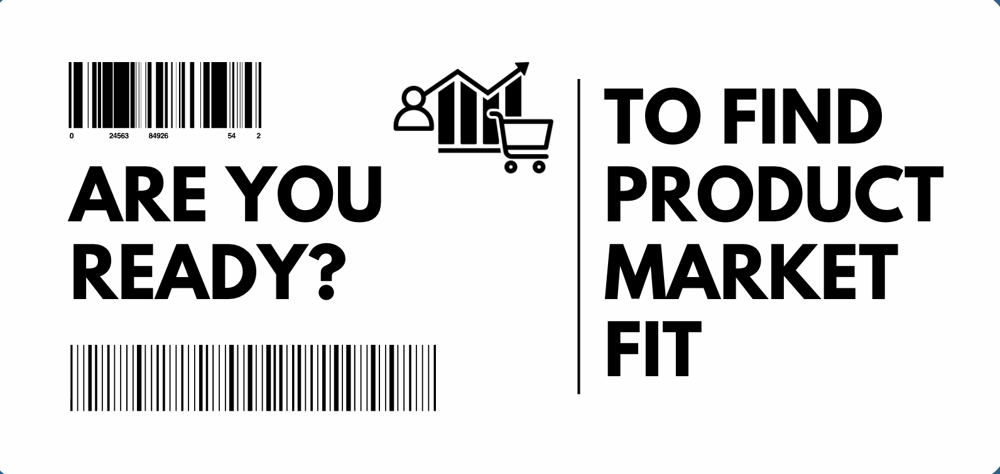

# PerkHive

## Problem
User research is expensive and time-consuming, making it difficult for startups with tight budgets to find market fit.

## Insight
We need some automated method of doing multiple interviews at the same time and finding the product market fit quick!

## Solution
PerkHive offers a marketplace that connects companies with 1,000 users that fit their specific criteria. By using AI-driven interview agents, companies can receive valuable feedback from users anytime, anywhere, making user research affordable and efficient.